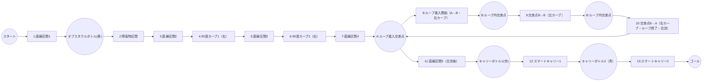

# ETロボコン・プライマリークラス 走行戦略レポート

## 1. 競技規定・コース仕様まとめ
- コース幅：約180mm、白線幅15mm、黒ライン幅15mm
- コース全長：約30m（1周）
- ペットボトル仕様：M1-354-01型 300mL、ラベル色（赤・青・黄、共通仕様、詳細は「ETRC2025_nansyo_1.0.2.pdf」参照）
- キャリーゲート通過回数：最大2回（ボーナス取得条件）
- 走行体サイズ：幅160mm×長さ200mm×高さ200mm以内
- 重量：1.0kg以下
- スタート方法：自律スタート（スタートボタン押下後、5秒以内に発進）
- ゴール条件：規定周回数（例：1周）を完走し、ゴールラインを通過
- ボーナス条件：キャリーゲート2回通過＋ボトル運搬成功

## 2. 走行体仕様・推定値
- LEGO Education SPIKE Prime Hub（ARM Cortex-M4 100MHz, RAM 320KB, MicroPython実行環境）
- Raspberry Pi 4 Model B（4GB RAM, Python 3, OpenCV, USB通信, SPIKE Primeと連携）
- SPIKE Prime Hub＋標準モーター2基＋カラー/距離センサー
- 標準タイヤ径：54mm（ETロボコン公式ホイール）
- 推定質量：約0.7～0.8kg
- 制御周期：約30ms（OpenCV制御）

## 3. ユーザー調整用パラメータ（run_opencv.py抜粋）
- ROI_OPENCV = (150, 300, 490, 400)
- BASE_POWER = 45
- STRAIGHT_POWER = 75
- CURVE_POWER = 30
- CURVE_THRESHOLD_DEG = 3.0
- SENSITIVITY = 0.4
- MAX_STEERING_POWER_DIFF = 20
- MAX_STEERING_THETA_DEG = 40
- BLACK_LINE_REFLECTED_THRESHOLD = 40
- BLACK_LINE_COLOR_THRESHOLD = 150

## 4. 走行戦略

### 4.1 ライン・オブスタクル区間攻略
- 直線区間はSTRIGHT_POWERで加速、カーブ・オブスタクル付近はBASE_POWERまたはCURVE_POWERで減速
- 黒ライン判定（カラーセンサー反射光R≦40, color≦150）でライン逸脱防止
- ボトル検出はHSV色抽出＋contour_area＋距離センサー併用
- オブスタクルボトルは黄色ラベル（共通仕様ペットボトル：M1-354-01型 300mL, ラベル色：赤・青・黄, 詳細は「ETRC2025_nansyo_1.0.2.pdf」参照）

### 4.2 ダブルループ区間攻略
- ダブルループ進入時はBASE_POWERで安定走行、カーブ判定でCURVE_POWERに自動減速
- ループ出口で直線復帰時にSTRIGHT_POWERへ切替

### 4.3 スマートキャリー1回目攻略
- キャリーゲート1回目通過時は減速・安定走行を重視
- ボトル運搬時はライン復帰・逸脱防止を優先
- キャリーボトル1は赤ラベル（共通仕様ペットボトル）

### 4.4 スマートキャリー2回目攻略
- 2回目のキャリーゲート通過も同様に減速・安定走行
- ボーナス取得条件を満たすため、確実なゲート通過とボトル運搬を両立
- キャリーボトル2は青ラベル（共通仕様ペットボトル）

### 4.5 目標タイム
- 全ボーナス取得時の目標タイム：約1分50秒

### 4.6 各区間ごとの推奨power値（Mermaid図順・目安）

| 区間                                 | 推奨power値 | 理由・備考                                   |
|--------------------------------------|-------------|----------------------------------------------|
| 直線区間1・2・3                      | 70～80      | STRAIGHT_POWER。最高速重視。安全マージン要調整。|
| 障害物区間（ラインオブスタクル）     | 40～55      | BASE_POWER～やや高め。障害物回避・安定性重視。|
| 90度カーブ1・2                       | 35～45      | BASE_POWER。脱線しない範囲。                 |
| ダブルループ（進入・内カーブ・出口） | 30～40      | CURVE_POWER。最も低速、安全最優先。          |
| スマートキャリー1                    | 30～45      | ボトル運搬時は減速・安定走行。               |
| スマートキャリー2                    | 30～45      | 1回目と同様。確実なゲート通過を優先。         |

※各区間名・順序はコース全体図（Mermaidエディタ貼り付け用）と対応。

#### power値と時速（理論値・目安）

| power値 | 理論時速[m/s] | 理論時速[km/h] |
|---------|---------------|---------------|
| 30      | 約0.36        | 約1.3         |
| 40      | 約0.48        | 約1.7         |
| 50      | 約0.60        | 約2.2         |
| 60      | 約0.72        | 約2.6         |
| 70      | 約0.84        | 約3.0         |
| 80      | 約0.96        | 約3.5         |

※計算式例：power=100で理論最高速約1.2m/s（タイヤ径54mm, 標準ギア比, 無負荷時）。power値に比例して時速を概算。

## 5. コース全体図（Mermaidエディタ貼り付け用）

※下記コードを https://mermaid.live/ にそのまま貼り付けてください。

### コース区間表（Mermaid図ID・ノード・遷移と完全対応）

| ID  | 区間名                        | 開始位置                | 終了位置                | 推奨power値 | 主な動作・注意点                        | 備考                |
|-----|-------------------------------|------------------------|------------------------|------------|-----------------------------------------|---------------------|
| 1   | 直線区間1                     | スタート(Start)         | オブスタクルボトル(黄)  | 70～80     | 加速・最高速重視                        | STRAIGHT_POWER      |
| 2   | オブスタクルボトル(黄)         | 直線区間1(S1)           | 障害物区間(OB)          | 40～55     | ボトル検知・回避                        | BASE_POWER          |
| 3   | 障害物区間                    | オブスタクルボトル(黄)  | 直線区間2(S2)           | 40～55     | 障害物回避・減速                        | BASE_POWER          |
| 4   | 直線区間2                     | 障害物区間(OB)          | 90度カーブ1(C1)         | 70～80     | 再加速                                  | STRAIGHT_POWER      |
| 5   | 90度カーブ1（右）             | 直線区間2(S2)           | 直線区間3(S3)           | 35～45     | 脱線防止・減速                          | BASE_POWER          |
| 6   | 直線区間3                     | 90度カーブ1(C1)         | 90度カーブ2(C2)         | 70～80     | 加速                                    | STRAIGHT_POWER      |
| 7   | 90度カーブ2（右）             | 直線区間3(S3)           | 直線区間4(S4)           | 35～45     | 脱線防止・減速                          | BASE_POWER          |
| 8   | 直線区間4                     | 90度カーブ2(C2)         | ループ進入交差点(A)      | 70～80     | 加速                                    | STRAIGHT_POWER      |
| 9   | ループ進入開始（A→B・右カーブ）| 直線区間4(S4)/A         | ループ内交差点(B)        | 30～40     | 進入時減速・安定走行                    | CURVE_POWER         |
| 10  | 交差点B→B（左カーブ）         | ループ内交差点(B)        | ループ内交差点(B2)       | 30～40     | ループ内左カーブ・最徐行                | CURVE_POWER         |
| 11  | 交差点B→A（右カーブ・合流）    | ループ内交差点(B2)       | ループ進入交差点(A)      | 30～40     | ループ出口・右カーブ・合流              | CURVE_POWER         |
| 12  | 直線区間5（合流後）            | ループ進入交差点(A)      | キャリーボトル1(赤)      | 70～80     | 合流後加速                              | STRAIGHT_POWER      |
| 13  | キャリーボトル1(赤)            | 直線区間5(RS)            | スマートキャリー1(G1)    | 30～45     | ボトル検知・運搬                        | BASE_POWER          |
| 14  | スマートキャリー1              | キャリーボトル1(赤)      | キャリーボトル2(青)      | 30～45     | 減速・安定走行・ゲート通過              | BASE_POWER          |
| 15  | キャリーボトル2(青)            | スマートキャリー1(G1)    | スマートキャリー2(G2)    | 30～45     | ボトル検知・運搬                        | BASE_POWER          |
| 16  | スマートキャリー2              | キャリーボトル2(青)      | ゴール(Goal)             | 30～45     | 減速・安定走行・ゲート通過              | BASE_POWER          |

※ID・区間名・開始/終了位置はMermaid図のノード・遷移と完全一致。
※A:ループ進入交差点、B:ループ内交差点、S1～S4:直線区間、C1/C2:カーブ、OB:障害物区間、G1/G2:スマートキャリー区間、RS:直線区間5。

## 6. 今後収集すべきコース・走行体・運用関連の詳細情報（分類・具体例）

### A. 走行体・ハードウェア仕様
- 総重量、重心位置、各輪荷重、タイヤ径・幅、ホイールベース、トレッド幅、ギア比、駆動方式
- センサー配置・高さ・角度、バッテリー容量・電圧、モーター型番・定格出力、制御周期
- 搭載基板・拡張モジュール、外装材質、各部寸法、実測値・設計値の差異
- 組立図・配線図・回路図、外観写真、耐久性・交換履歴

### B. 走行体・ソフトウェア/制御
- 主要アルゴリズムのフローチャート、バージョン管理・変更履歴
- ユニットテスト・シミュレーション環境、異常時の自動検知・安全停止ロジック
- パラメータ調整・現場での即時反映手順

### C. センサー・カメラ・計測
- カメラ画角・設置高さ・傾き、センサーの設置位置・個体差・校正値
- 応答遅延・ノイズ特性、照明・外光の影響、閾値調整の根拠

### D. コース・障害物・環境
- 各区間（直線1/2/3、障害物、カーブ1/2、ダブルループ、スマートキャリー1/2）の長さ・幅・開始/終了位置
- カーブの半径、角度、曲率分布、カーブ前後の直線長
- 障害物（ボトル等）の設置位置（X,Y座標）、個数、種類、サイズ、色、材質、固定/可動の有無
- ダブルループの形状（ループ径、幅、進入/出口角度、ループ内の路面状態）
- スマートキャリーゲートの位置、高さ、幅、通過条件、センサー設置有無
- 路面素材（アクリル/カーペット/ゴム等）、摩擦係数、色、反射率、段差・継ぎ目・傾斜の有無
- コース全体の高低差：なし（公式仕様より）
- 白線・黒ラインの幅、色味、反射率、ライン間隔、ラインの途切れや分岐の有無
- スタート・ゴール位置の絶対座標、幅、計測方法（自動/手動/センサー方式）

### E. 競技ルール・運用・会場
- 競技ルール上のペナルティ条件、失格条件、ボーナス取得条件、公式Q&A・レギュレーション変更履歴
- コース設置環境（照明条件、外光・影の影響、温度・湿度、設置床の材質・水平度）
- 会場の搬入・設置・撤収手順、必要な工具・予備部品リスト、会場の電源・ネットワーク環境
- 競技当日のコース設置バリエーション（パターン違い、障害物配置の変更可能性）

### F. 実走行データ・トラブル・他チーム情報
- 実際の走行ログ（速度・加速度・パワー・センサー値・画像・イベント時刻、逸脱・減速・加速イベントの発生位置、ログの可視化方法）
- 走行体の消費電流・電力、バッテリー劣化・電圧低下時の挙動
- 走行体の振動・ノイズ・トラブル事例
- 公式図面・現地写真・実測値の比較、図面と現地の差異
- 他チームの戦略・機体仕様の傾向（公開情報・過去大会レポート等）
- 参考：過去大会のコース仕様・変更点・トラブル事例

### G. 機能実装・運用支援・安全性
- センサー値異常時のフェールセーフ動作（例：値がNaN/0/最大値の場合の処理）
- 通信断・ハード障害時の安全停止・リカバリ手順
- 例外発生時のログ出力・通知仕様
- 現場での自動キャリブレーション手順（例：白・黒ライン自動検出、カメラ位置自動調整）
- パラメータ調整UIやCLIの有無・設計方針
- センサー値・制御信号・画像処理結果のリアルタイム可視化方法
- ログの保存形式・容量・取得頻度・リモート取得手段
- 新型センサー・追加モジュール対応のためのインターフェース設計
- 複数コース・複数戦略の切替機能
- 緊急停止スイッチ・遠隔停止コマンドの実装有無
- バッテリー異常・過熱時の自動停止
- よくあるトラブルとその対処フロー（例：センサー誤動作、通信エラー、パラメータ初期化）

※この分類に沿って情報を整理・収集することで、戦略設計・パラメータ最適化・現場運用・リスク対策が効率的に進められます。

---

## 参考資料・索引
- ETロボコン公式競技規定2025（C:\Users\MSAD\Box\msad2025\事務局配布資料\ETRC2025_rules_primary_advanced_1.0.1.pdf）
- SPIKE Prime Hub技術仕様（C:\Users\MSAD\Box\msad2025\事務局配布資料\SPIKE_Prime_Hub_spec.pdf など）
- run_opencv.py（C:\Users\MSAD\github\nnspike\run_opencv.py, 2025/6/24時点）
- spike_usb_comm_report.txt（C:\Users\MSAD\github\nnspike\output\spike_usb_comm_report.txt）
- 事務局配布資料一式（C:\Users\MSAD\Box\msad2025\事務局配布資料\）

（本レポートは2025年6月24日作成。パラメータ・戦略はコース・走行体仕様に応じて適宜調整してください）
