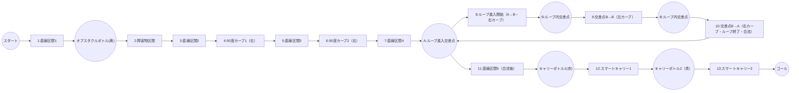

# ETロボコン・プライマリークラス 走行戦略レポート

## 1. 競技規定・コース仕様まとめ
- コース幅：約180mm、白線幅15mm、黒ライン幅15mm
- コース全長：約30m（1周）
- ペットボトル仕様：M1-354-01型 300mL、ラベル色（赤・青・黄、共通仕様、詳細は「ETRC2025_nansyo_1.0.2.pdf」参照）
- キャリーゲート通過回数：最大2回（ボーナス取得条件）
- 走行体サイズ：幅160mm×長さ200mm×高さ200mm以内
- 重量：1.0kg以下
- スタート方法：自律スタート（スタートボタン押下後、5秒以内に発進）
- ゴール条件：規定周回数（例：1周）を完走し、ゴールラインを通過
- ボーナス条件：キャリーゲート2回通過＋ボトル運搬成功

## 2. 走行体仕様・推定値
- LEGO Education SPIKE Prime Hub（ARM Cortex-M4 100MHz, RAM 320KB, MicroPython実行環境）
- Raspberry Pi 4 Model B（4GB RAM, Python 3, OpenCV, USB通信, SPIKE Primeと連携）
- SPIKE Prime Hub＋標準モーター2基＋カラー/距離センサー
- 標準タイヤ径：54mm（ETロボコン公式ホイール）
- 推定質量：約0.7～0.8kg
- 制御周期：約30ms（OpenCV制御）

## 3. ユーザー調整用パラメータ（run_opencv.py抜粋）
- ROI_OPENCV = (150, 300, 490, 400)
- BASE_POWER = 45
- STRAIGHT_POWER = 75
- CURVE_POWER = 30
- CURVE_THRESHOLD_DEG = 3.0
- SENSITIVITY = 0.4
- MAX_STEERING_POWER_DIFF = 20
- MAX_STEERING_THETA_DEG = 40
- BLACK_LINE_REFLECTED_THRESHOLD = 40
- BLACK_LINE_COLOR_THRESHOLD = 150

## 4. 走行戦略

### 4.1 ライン・オブスタクル区間攻略
- 直線区間はSTRIGHT_POWERで加速、カーブ・オブスタクル付近はBASE_POWERまたはCURVE_POWERで減速
- 黒ライン判定（カラーセンサー反射光R≦40, color≦150）でライン逸脱防止
- ボトル検出はHSV色抽出＋contour_area＋距離センサー併用
- オブスタクルボトルは黄色ラベル（共通仕様ペットボトル：M1-354-01型 300mL, ラベル色：赤・青・黄, 詳細は「ETRC2025_nansyo_1.0.2.pdf」参照）

### 4.2 ダブルループ区間攻略
- ダブルループ進入時はBASE_POWERで安定走行、カーブ判定でCURVE_POWERに自動減速
- ループ出口で直線復帰時にSTRIGHT_POWERへ切替

### 4.3 スマートキャリー1回目攻略
- キャリーゲート1回目通過時は減速・安定走行を重視
- ボトル運搬時はライン復帰・逸脱防止を優先
- キャリーボトル1は赤ラベル（共通仕様ペットボトル）

### 4.4 スマートキャリー2回目攻略
- 2回目のキャリーゲート通過も同様に減速・安定走行
- ボーナス取得条件を満たすため、確実なゲート通過とボトル運搬を両立
- キャリーボトル2は青ラベル（共通仕様ペットボトル）

### 4.5 目標タイム
- 全ボーナス取得時の目標タイム：約1分50秒

### 4.6 各区間ごとの推奨power値（Mermaid図順・目安）

| 区間名                        | 推奨power値 | 理由・備考                                   |
|-------------------------------|-------------|----------------------------------------------|
| 直線区間（1・2・3・4・5）      | 70～80      | STRAIGHT_POWER。最高速重視。安全マージン要調整。|
| 障害物区間                    | 30～40      | CURVE_POWER。障害物回避・安定性重視。         |
| 90度カーブ（1・2）             | 30～40      | CURVE_POWER。脱線防止・減速。                 |
| ループ進入・内カーブ・合流     | 30～40      | CURVE_POWER。最徐行・安定走行。               |
| スマートキャリー（1・2）        | 30～45      | BASE_POWER。減速・安定走行・ゲート通過・ボトル検知・運搬。 |

※オブスタクルボトル(黄)・キャリーボトル（赤・青）は区間名ではなく、各区間内の障害物・イベントとして扱う。

#### power値と速度（理論値・目安）

| power値 | 理論速度[m/s] | 理論速度[cm/s] | 理論速度[km/h] |
|---------|---------------|----------------|----------------|
| 30      | 0.36          | 36             | 1.3            |
| 40      | 0.48          | 48             | 1.7            |
| 50      | 0.60          | 60             | 2.2            |
| 60      | 0.72          | 72             | 2.6            |
| 70      | 0.84          | 84             | 3.0            |
| 80      | 0.96          | 96             | 3.5            |

※計算式例：power=100で理論最高速1.2m/s（タイヤ径54mm, 標準ギア比, 無負荷時）。power値に比例して速度[m/s]・速度[cm/s]・速度[km/h]を概算。

## 5. コース全体図（Mermaidエディタ貼り付け用）

※下記コードを https://mermaid.live/ にそのまま貼り付けてください。

### コース区間表（Mermaid図ID・ノード・遷移と完全対応）

| ID  | 区間名                | 開始位置      | 終了位置      | 推奨power値 | 主な動作・注意点                  | 備考                |
|-----|-----------------------|--------------|--------------|------------|-----------------------------------|---------------------|
| 1   | 直線区間1             | スタート      | 障害物区間    | 70～80     | 加速・最高速重視                  | STRAIGHT_POWER      |
| 2   | 障害物区間            | 直線区間1     | 直線区間2     | 30～40     | 障害物回避・安定性重視            | CURVE_POWER         |
| 3   | 直線区間2             | 障害物区間    | 90度カーブ1   | 70～80     | 再加速                            | STRAIGHT_POWER      |
| 4   | 90度カーブ1（右）     | 直線区間2     | 直線区間3     | 30～40     | 脱線防止・減速                    | CURVE_POWER         |
| 5   | 直線区間3             | 90度カーブ1   | 90度カーブ2   | 70～80     | 加速                              | STRAIGHT_POWER      |
| 6   | 90度カーブ2（右）     | 直線区間3     | 直線区間4     | 30～40     | 脱線防止・減速                    | CURVE_POWER         |
| 7   | 直線区間4             | 90度カーブ2   | ループ進入    | 70～80     | 加速                              | STRAIGHT_POWER      |
| 8   | ループ進入・内カーブ・合流 | 直線区間4/ループ進入 | 直線区間5   | 30～40     | 最徐行・安定走行                  | CURVE_POWER         |
| 9   | 直線区間5（合流後）    | ループ合流    | スマートキャリー1 | 70～80     | 合流後加速                        | STRAIGHT_POWER      |
| 10  | スマートキャリー1      | 直線区間5     | スマートキャリー2 | 30～45     | 減速・安定走行・ゲート通過・ボトル検知・運搬 | BASE_POWER          |
| 11  | スマートキャリー2      | スマートキャリー1 | ゴール       | 30～45     | 減速・安定走行・ゲート通過・ボトル検知・運搬 | BASE_POWER          |

※オブスタクルボトル(黄)・キャリーボトル（赤・青）は区間名ではなく、各区間内の障害物・イベントとして扱う。
※コース全体図・推奨power値表と常に整合性を維持。

## 6. 今後収集すべきコース・走行体・運用関連の詳細情報（分類・具体例）

### A. 走行体・ハードウェア仕様
- SPIKE Prime Hub/Raspberry Pi型番・拡張モジュール・搭載基板の詳細
- 総重量・重心・各輪荷重・タイヤ径/幅・ホイールベース・トレッド幅・ギア比・駆動方式
- センサー/カメラ/バッテリーの配置・高さ・角度・型番・容量・電圧・交換性
- モーター型番・定格出力・制御周期・配線/組立/回路図・外観写真・耐久性・現場交換履歴
- 実測値と設計値の差異・現場での調整/修理性

### B. 走行体・ソフトウェア/制御
- 主要アルゴリズムのフローチャート・バージョン管理・変更履歴
- パラメータ調整・現場即時反映手順・自動テスト/シミュレーション環境
- 異常時の自動検知・安全停止・フェールセーフ動作・例外時のログ出力/通知
- 複数戦略/コース切替機能・パラメータUI/CLI設計方針

### C. センサー・カメラ・計測
- カメラ画角・設置高さ・傾き・センサー設置位置・個体差・校正値
- 応答遅延・ノイズ特性・照明/外光の影響・閾値調整根拠
- 自動キャリブレーション手順（白黒ライン自動検出・カメラ位置調整）
- センサー値・画像処理結果のリアルタイム可視化方法

### D. コース・障害物・環境
- 各区間（直線/障害物/カーブ/ループ/キャリー）の長さ・幅・開始/終了位置
- カーブ半径・角度・曲率分布・前後直線長・障害物（ボトル等）の設置位置/個数/種類/サイズ/色/材質/固定可動
- ダブルループ形状（径・幅・進入/出口角度・路面状態）・キャリーゲート位置/高さ/幅/通過条件
- 路面素材・摩擦係数・色・反射率・段差/継ぎ目/傾斜・白線/黒ライン仕様（幅・色味・反射率・間隔・分岐）
- スタート/ゴール位置の絶対座標・計測方法（自動/手動/センサー）・公式図面vs現地差異

### E. 競技ルール・運用・会場
- ペナルティ/失格/ボーナス条件・公式Q&A/レギュレーション変更履歴
- コース設置環境（照明・外光・温度・湿度・床材・水平度）・設置/撤収/搬入手順・工具/予備部品リスト
- 会場電源/ネットワーク環境・コース設置バリエーション（障害物配置パターン等）

### F. 実走行データ・トラブル・他チーム情報
- 実走行ログ（速度・加速度・パワー・センサー値・画像・イベント時刻・逸脱/減速/加速イベント位置・可視化方法）
- 消費電流/電力・バッテリー劣化/電圧低下時挙動・振動/ノイズ/トラブル事例
- 公式図面/現地写真/実測値の比較・他チーム戦略/機体仕様傾向（公開情報・過去大会レポート）
- 過去大会コース仕様・変更点・トラブル事例

### G. 機能実装・運用支援・安全性
- センサー値異常時のフェールセーフ・通信断/ハード障害時の安全停止/リカバリ手順
- 例外発生時のログ出力/通知・自動キャリブレーション・パラメータ調整UI/CLI
- センサー値/制御信号/画像処理結果のリアルタイム可視化・ログ保存形式/容量/取得頻度/リモート取得
- 新型センサー/追加モジュール対応インターフェース設計・複数コース/戦略切替機能
- 緊急停止スイッチ/遠隔停止コマンド・バッテリー異常/過熱時の自動停止
- よくあるトラブルと対処フロー（センサー誤動作・通信エラー・パラメータ初期化等）

※この分類に沿って情報を整理・収集することで、戦略設計・パラメータ最適化・現場運用・リスク対策が効率的に進められます。

---

## 参考資料・索引
- ETロボコン公式競技規定2025（C:\Users\MSAD\Box\msad2025\事務局配布資料\ETRC2025_rules_primary_advanced_1.0.1.pdf）
- SPIKE Prime Hub技術仕様（C:\Users\MSAD\Box\msad2025\事務局配布資料\SPIKE_Prime_Hub_spec.pdf など）
- run_opencv.py（C:\Users\MSAD\github\nnspike\run_opencv.py, 2025/6/24時点）
- spike_usb_comm_report.txt（C:\Users\MSAD\github\nnspike\output\spike_usb_comm_report.txt）
- 事務局配布資料一式（C:\Users\MSAD\Box\msad2025\事務局配布資料\）

（本レポートは2025年6月24日作成。パラメータ・戦略はコース・走行体仕様に応じて適宜調整してください）
