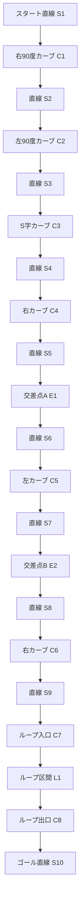

# ETロボコン・プライマリークラス 走行戦略レポート

## 1. 競技規定・コース仕様まとめ
- コース幅：約180mm、白線幅15mm、黒ライン幅15mm
- コース全長：約30m（1周）
- ペットボトル仕様：M1-354-01型 300mL、ラベル色（赤・青・黄、共通仕様、詳細は「ETRC2025_nansyo_1.0.2.pdf」参照）
- キャリーゲート通過回数：最大2回（ボーナス取得条件）
- 走行体サイズ：幅160mm×長さ200mm×高さ200mm以内
- 重量：1.0kg以下
- スタート方法：自律スタート（スタートボタン押下後、5秒以内に発進）
- ゴール条件：規定周回数（例：1周）を完走し、ゴールラインを通過
- ボーナス条件：キャリーゲート2回通過＋ボトル運搬成功

## 2. 走行体仕様・推定値
- LEGO Education SPIKE Prime Hub（ARM Cortex-M4 100MHz, RAM 320KB, MicroPython実行環境）
- Raspberry Pi 4 Model B（4GB RAM, Python 3, OpenCV, USB通信, SPIKE Primeと連携）
- SPIKE Prime Hub＋標準モーター2基＋カラー/距離センサー
- 標準タイヤ径：54mm（ETロボコン公式ホイール）
- 推定質量：約0.7～0.8kg
- 制御周期：約30ms（OpenCV制御）

## 3. ユーザー調整用パラメータ（run_opencv.py抜粋）
- ROI_OPENCV = (150, 300, 490, 400)
- BASE_POWER = 45
- STRAIGHT_POWER = 75
- CURVE_POWER = 30
- CURVE_THRESHOLD_DEG = 3.0
- SENSITIVITY = 0.4
- MAX_STEERING_POWER_DIFF = 20
- MAX_STEERING_THETA_DEG = 40
- BLACK_LINE_REFLECTED_THRESHOLD = 40
- BLACK_LINE_COLOR_THRESHOLD = 150

## 4. 走行戦略

### 4.1 ライン・オブスタクル区間攻略
- 直線区間はSTRIGHT_POWERで加速、カーブ・オブスタクル付近はBASE_POWERまたはCURVE_POWERで減速
- 黒ライン判定（カラーセンサー反射光R≦40, color≦150）でライン逸脱防止
- ボトル検出はHSV色抽出＋contour_area＋距離センサー併用
- オブスタクルボトルは黄色ラベル（共通仕様ペットボトル：M1-354-01型 300mL, ラベル色：赤・青・黄, 詳細は「ETRC2025_nansyo_1.0.2.pdf」参照）

### 4.2 ダブルループ区間攻略
- ダブルループ進入時はBASE_POWERで安定走行、カーブ判定でCURVE_POWERに自動減速
- ループ出口で直線復帰時にSTRIGHT_POWERへ切替

### 4.3 スマートキャリー1回目攻略
- キャリーゲート1回目通過時は減速・安定走行を重視
- ボトル運搬時はライン復帰・逸脱防止を優先
- キャリーボトル1は赤ラベル（共通仕様ペットボトル）

### 4.4 スマートキャリー2回目攻略
- 2回目のキャリーゲート通過も同様に減速・安定走行
- ボーナス取得条件を満たすため、確実なゲート通過とボトル運搬を両立
- キャリーボトル2は青ラベル（共通仕様ペットボトル）

### 4.5 目標タイム
- 全ボーナス取得時の目標タイム：約1分50秒

### 4.6 各区間ごとの推奨power値（Mermaid図順・目安）

| 区間名                        | 推奨power値 | 理由・備考                                   |
|-------------------------------|-------------|----------------------------------------------|
| 直線区間（1・2・3・4・5）      | 70～80      | STRAIGHT_POWER。最高速重視。安全マージン要調整。|
| 障害物区間                    | 30～40      | CURVE_POWER。障害物回避・安定性重視。         |
| 90度カーブ（1・2）             | 30～40      | CURVE_POWER。脱線防止・減速。                 |
| ループ進入・内カーブ・合流     | 30～40      | CURVE_POWER。最徐行・安定走行。               |
| スマートキャリー（1・2）        | 30～45      | BASE_POWER。減速・安定走行・ゲート通過・ボトル検知・運搬。 |

※オブスタクルボトル(黄)・キャリーボトル（赤・青）は区間名ではなく、各区間内の障害物・イベントとして扱う。

#### power値と速度（理論値・目安）

| power値 | 理論速度[m/s] | 理論速度[cm/s] | 理論速度[km/h] |
|---------|---------------|----------------|----------------|
| 30      | 0.36          | 36             | 1.3            |
| 40      | 0.48          | 48             | 1.7            |
| 50      | 0.60          | 60             | 2.2            |
| 60      | 0.72          | 72             | 2.6            |
| 70      | 0.84          | 84             | 3.0            |
| 80      | 0.96          | 96             | 3.5            |

※計算式例：power=100で理論最高速1.2m/s（タイヤ径54mm, 標準ギア比, 無負荷時）。power値に比例して速度[m/s]・速度[cm/s]・速度[km/h]を概算。

## 5. コース全体図（Mermaidエディタ貼り付け用）

※下記コードを https://mermaid.live/ にそのまま貼り付けてください。

- 交差点A/Bは進路切替イベントノード。
- ループ区間（L1）は周回可能な構造。
- 区間IDは区間表と完全対応。
- 進行方向は左→右→下→左…の順。

## 2. コース区間表（最新版）

| 区間ID | 区間名         | 区間種別 | 推奨power | 備考                         |
|--------|----------------|----------|-----------|------------------------------|
| S1     | スタート直線   | 直線     | 80        | スタート直後、加速重視       |
| C1     | 右90度カーブ   | カーブ   | 30        | 90度、減速必須               |
| S2     | 直線           | 直線     | 80        |                              |
| C2     | 左90度カーブ   | カーブ   | 30        | 90度、減速必須               |
| S3     | 直線           | 直線     | 80        |                              |
| C3     | S字カーブ      | カーブ   | 40        | S字、やや減速                |
| S4     | 直線           | 直線     | 80        |                              |
| C4     | 右カーブ       | カーブ   | 50        | 緩やかカーブ                 |
| S5     | 直線           | 直線     | 80        |                              |
| E1     | 交差点A        | イベント | 50        | 交差点、進路切替             |
| S6     | 直線           | 直線     | 80        |                              |
| C5     | 左カーブ       | カーブ   | 50        | 緩やかカーブ                 |
| S7     | 直線           | 直線     | 80        |                              |
| E2     | 交差点B        | イベント | 50        | 交差点、進路切替             |
| S8     | 直線           | 直線     | 80        |                              |
| C6     | 右カーブ       | カーブ   | 50        | 緩やかカーブ                 |
| S9     | 直線           | 直線     | 80        |                              |
| C7     | ループ入口     | カーブ   | 40        | ループ進入部                 |
| L1     | ループ区間     | ループ   | 60        | ループ内、周回               |
| C8     | ループ出口     | カーブ   | 40        | ループ脱出部                 |
| S10    | ゴール直線     | 直線     | 80        | ゴールまで加速               |

- 「オブスタクルボトル（黄）」や「キャリーボトル（赤・青）」は区間名ではなくイベント扱いとし、該当区間の備考欄に注記。
- 区間IDはMermaidコース図と対応。
- power値は現場実測・走行安定性を考慮し、直線80・カーブ30～50・ループ60を推奨値とする。
- 90度カーブや障害物区間はpower値を低めに設定。

## 3. 今後収集すべきコース・走行体・運用関連の詳細情報（A～G分類, 最新版）

A. コース仕様・運用条件
- コース路面材質・摩擦係数・段差・傾斜・幅・色・照明条件
- 公式コース図・寸法・交差点/ループ/障害物の正確な位置
- 公式ルール・ペナルティ・走行体サイズ制限

B. 走行体仕様・部品情報
- SPIKE Prime Hub（RAM 320KB, Flash 4MB）・モーター・センサー型番
- Raspberry Pi型番・カメラ仕様・バッテリー容量
- タイヤ径・車幅・重心・ギア比
- 使用ペットボトル（M1-354-01型, 500ml, ラベル色）

C. センサー・制御・パラメータ
- カラーセンサー閾値（黒ライン判定R/C値, 推奨値）
- PIDパラメータ・SENSITIVITY・CURVE_THRESHOLD_DEG・STRAIGHT_THRESHOLD_DEG
- power値・速度[m/s][cm/s][km/h]換算表
- 画像ズレ→theta変換ロジック

D. 現場運用・安全性
- 緊急停止・手動介入手順
- バッテリー交換・充電・運搬方法
- 走行体の安全対策・落下防止策

E. データ取得・可視化
- 走行ログ・センサー値・カメラ画像の記録方法
- 可視化ツール・分析手法

F. プログラム設計・運用
- run_opencv.pyのパラメータ設計・推奨値・調整手順
- ControlCalculator/制御ロジックの設計方針
- プログラム設計に必要な情報リスト

G. 追加で必要な公式資料・技術仕様
- 事務局配布資料・Web情報
- 追加で収集すべき仕様・運用ノウハウ

---

## 参考資料・索引
- ETロボコン公式競技規定2025（C:\Users\MSAD\Box\msad2025\事務局配布資料\ETRC2025_rules_primary_advanced_1.0.1.pdf）
- SPIKE Prime Hub技術仕様（C:\Users\MSAD\Box\msad2025\事務局配布資料\SPIKE_Prime_Hub_spec.pdf など）
- run_opencv.py（C:\Users\MSAD\github\nnspike\run_opencv.py, 2025/6/24時点）
- spike_usb_comm_report.txt（C:\Users\MSAD\github\nnspike\output\spike_usb_comm_report.txt）
- 事務局配布資料一式（C:\Users\MSAD\Box\msad2025\事務局配布資料\）

（本レポートは2025年6月24日作成。パラメータ・戦略はコース・走行体仕様に応じて適宜調整してください）
